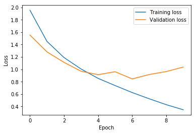

# Custom-Image-Classifier-for-CIFAR-10

## Project Overview
In this project, I attempted to create a custom image classifier to explore the Deep Learning concept in PyTorch. The goal of the project is to achieve an accuracy of ~70% on the CIFAR-10 images. The CIFAR-10 serves as the benchmark for development of image classifier. 
But before making this purchase, management wants to explore whether you can build an in-house solution that performs well. They have asked you to try your hand at creating a neural network that can classify arbitrary objects and potentially be fine-tuned on a larger dataset using transfer learning. 
This dataset has spurred loads of innovation in neural network design and implementation. The current state of the art is a 99% accuracy rate, achieved by GPipe, which has 557 million parameters and was developed in late 2018. GPipe is an extremely large network with a lot of advanced techniques not introduced in this course, but feel free to use any architecture that suits your needs.

The ten classification images included :

The following are the main steps of this project:

    Explore and prepare the data for training and testing.
    Design and build your neural network.
    Train the neural network on the training set.
    Evaluate your network's performance on the test set.
    Make a recommendation on the build vs. buy business decision.

## Set up
The dataset of CIFAR-10 was included in the torchvision module, so the notebook is a complete take on the project without external dataset downloads. Note that the implementation requires CUDA to be activated.

## Results
The test accuracy achieved 71.6% despite the use of simple convolutional layer with optimized hyperparameters (structure of convolutional layer and the number of hidden layers). 

However, some overfitting might have occured since the validation loss was higher than the training loss. Further optimization of the layer architecture or transfer learning would be able to increase the accuracy higher.
